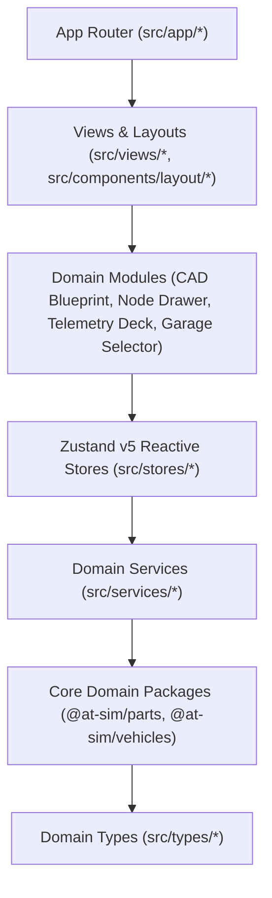

# Apex Forge — Architecture Map & Codebase Blueprint (ARCHITECTURE.md)

> **Slogan**: «BUILT, NOT BOUGHT»  
> **Manifesto**: «Apex Forge — The Local-First Modding Canvas for Track & Street Builds»

This blueprint documents the Clean Architecture layers, reactive Zustand v5 state stores, domain services, and UI component hierarchy for **Apex Forge**, inheriting the architectural core of `C:\Users\bytes\singularity-fleet-core`.

---

## 1. Clean Architecture Layers



| Layer | Directory | Responsibilities & Invariants |
| :--- | :--- | :--- |
| **Routing & App Entry** | `src/app/` | Next.js 16 App Router. Root layout, metadata, global Tailwind stylesheet. |
| **Domain Views** | `src/views/` | Top-level view controllers (`GarageView.tsx`, `BlueprintView.tsx`). |
| **Presentation Modules**| `src/components/*` | Focused UI components: CAD blueprint canvas, node swap drawer, telemetry KPI cards, vehicle picker. |
| **Reactive State** | `src/stores/*` | Zustand v5 client stores: `useVehicleStore`, `useBuildStore`, `useUiStore`. Zero cascades. |
| **Domain Services** | `src/services/*` | Pure business algorithms: `telemetryService.ts`, `swapService.ts`, `catalogFilterService.ts`. |
| **Domain Constants** | `src/constants/*` | Brand labels, region definitions, drivetrain layout terminology, units, OEM benchmarks. |
| **Leaf Types** | `src/types/*` | Clean TypeScript interfaces and contracts. Strictly no `any`. |

---

## 2. Zustand v5 Stores Directory (`src/stores/*`)

| Store Hook | File Location | Purpose & State Managed |
| :--- | :--- | :--- |
| **`useVehicleStore`** | `src/stores/useVehicleStore.ts` | Vehicle catalog listing, active vehicle selection, search queries, region & drivetrain filters. |
| **`useBuildStore`** | `src/stores/useBuildStore.ts` | Active build configuration (engine, gearbox, driveline, turbo, intake, exhaust, brakes, suspension, ECU), equip/reset actions. |
| **`useUiStore`** | `src/stores/useUiStore.ts` | Active view mode (`garage` vs `blueprint`), active drawer node (`engine`, `transmission`, etc.), search query within drawer, toast alerts. |

---

## 3. Domain Services (`src/services/*`)

| Service File | Responsibilities |
| :--- | :--- |
| **`src/services/telemetryService.ts`** | Computes 0-100 km/h, 100-200 km/h, 1/4 mile ET/trap speed, braking distance, lateral G, and drivetrain torque safety headroom using `@at-sim/parts/telemetry`. |
| **`src/services/swapService.ts`** | Evaluates compatible swaps for all 9 vehicle nodes (`bolt-in`, `kit`, `custom`) using `listSwaps` and fitment scoring. |
| **`src/services/catalogFilterService.ts`**| Multi-criteria filtering and sorting for vehicles and components (by power, year, fitment tier, alphabetical). |

---

## 4. UI Component Architecture (`src/components/*`)

```
src/components/
├── layout/
│   ├── AppHeader.tsx             # Brand header, "BUILT, NOT BOUGHT" banner, mode switch
│   └── ToastNotification.tsx     # Micro-feedback for parts swap & reset actions
├── blueprint/
│   ├── BlueprintCanvas.tsx       # 2D CAD Blueprint chassis schematic & grid overlay
│   ├── BlueprintNodeHotspot.tsx  # Interactive clickable node pins on chassis
│   └── BlueprintLegend.tsx       # Node status & fitment tier legend
├── drawer/
│   ├── NodeSwapDrawer.tsx        # Slide-over swap catalog with search & fitment pills
│   ├── PartSwapCard.tsx          # Individual part card with OEM specs & delta badges
│   └── FitmentBadge.tsx          # bolt-in / kit / custom status chips
├── telemetry/
│   ├── TelemetryDeck.tsx         # Performance KPI summary deck
│   ├── DynoGaugeCard.tsx         # Power / Torque / Power-to-weight gauges
│   ├── DragStripCard.tsx         # 0-100, 100-200, 1/4 mile acceleration strip
│   └── SafetyWarningsCard.tsx    # Drivetrain stress, transmission torque headroom, cooling alerts
└── garage/
    ├── VehicleSelector.tsx       # Searchable car picker with brand and layout pills
    ├── VehicleSpecsCard.tsx      # Stock chassis specs, engine bay layout, factory weight
    └── WorkshopManualAccordion.tsx# Authentic OEM workshop reference cards
```

---

## 5. Architectural Invariants & Guardrails

1. **Zero Barrel Files**: Never create `index.ts` / `index.tsx`. All imports point directly to target modules.
2. **React 19 Hook Ordering**: Hooks execute unconditionally at top of component. No early returns before hooks.
3. **Tailwind CSS Utility Purity**: 100% Tailwind CSS classes. No inline `style={{ ... }}` objects.
4. **Strict Types**: Zero `any`. All type imports use `import type`.
5. **Production Purity**: Zero `console.log`.
